# Orbiscale · Network Ops Console

**Your whole infrastructure on one screen — one country or the whole world.**
Map, topology, inventory, health, telephony, partners, multicloud discovery, work on the map, FinOps and layer-by-layer troubleshooting, in a single static web app. No backend, no build step.

> 🔗 **Live demo:** https://netorojas.github.io/knoc-network-ops-console/
> 🧪 All data is **fictional** (company "Contoso Global"). IPs come from the RFC 1918 and RFC 5737 documentation ranges.
> 🏷️ Formerly **KNOC** and **Orbinoc**. Same project, new name: **Orbiscale** (orbit + scale, from one country to the whole world).

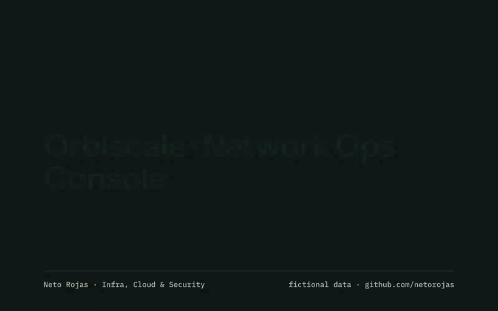

▶️ [Full walkthrough (MP4, with captions and sound)](docs/media/orbiscale-v5.mp4) · soundtrack is an original composition generated in code, free to reuse (CC0)

---

## ✨ v5.3 · Orbiscale Flow, profile and access administration

- **Orbiscale Flow** — the team board (formerly Infra Backlog) is now a module: [live](https://netorojas.github.io/knoc-network-ops-console/flow/) · [code](flow/).
- **My profile** — start page, cost persona, digest, quiet hours, my access, export or erase my data.
- **Administration** — users, Entra ID groups, per-module permissions across both tools, PIM-style temporary elevation and audit.
- **View as** — see the product through someone else's permissions.
- [Benchmark and market positioning](docs/benchmark.md).

| Module permissions | Temporary elevation |
|---|---|
| 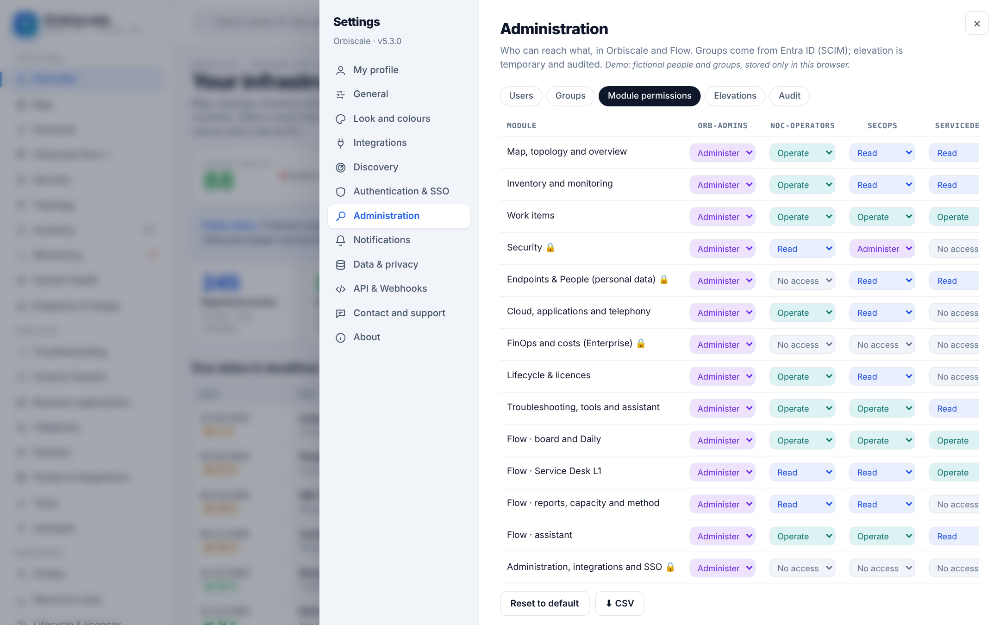 | 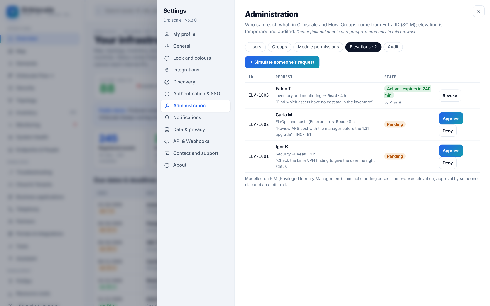 |
| **View as (Service Desk)** | **Orbiscale Flow** |
| 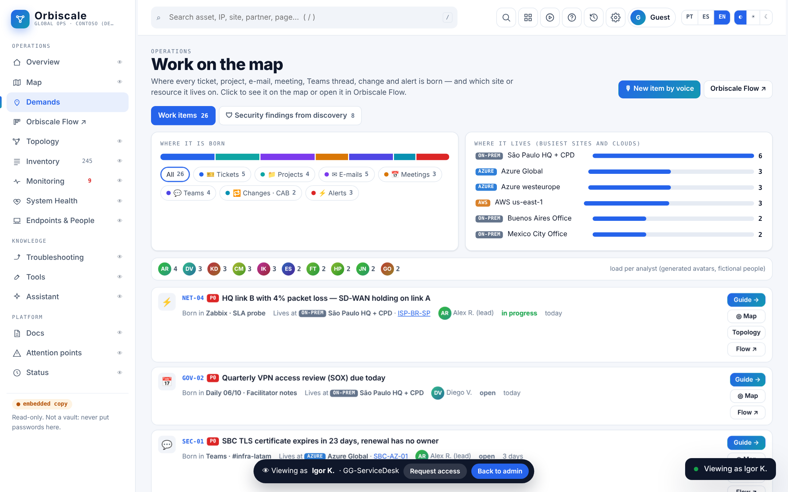 | 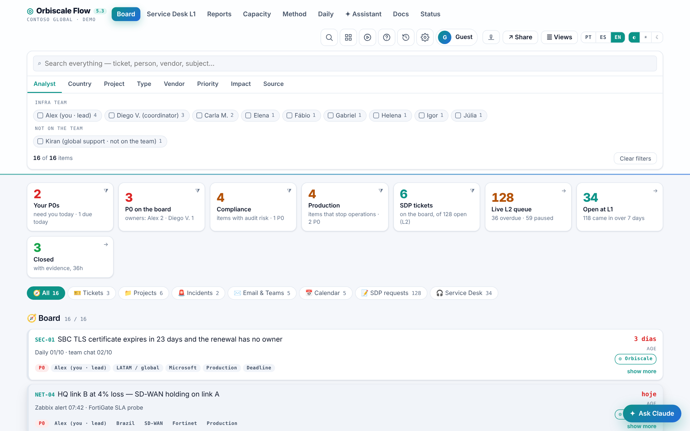 |

## ✨ v5.2 · Security, lifecycle, business apps and voice intake

- **Security:** one list for cloud, on-prem and endpoint vulnerabilities, with the tool that found each one and a *how to act* guide that links to the map, topology, inventory and the business apps affected.
- **Lifecycle & licences:** installed vs latest release, end of support and renewals for the next 12 months.
- **Business applications:** where each system runs, what it depends on and what is at risk.
- **Endpoints from several tools:** Intune, IBM MaaS360, Jamf, AWS WorkSpaces, Azure Virtual Desktop and IBM Cloud VDI side by side.
- **Voice intake:** a WhatsApp-style voice note becomes a classified draft work item with a pin on the map ([design](docs/voice-intake.md)).

| Security | How to act |
|---|---|
| 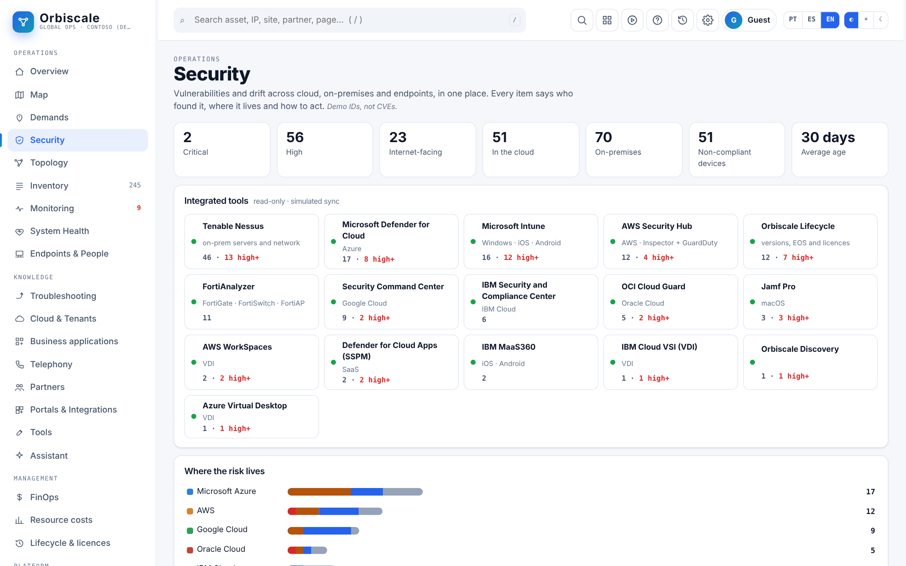 | 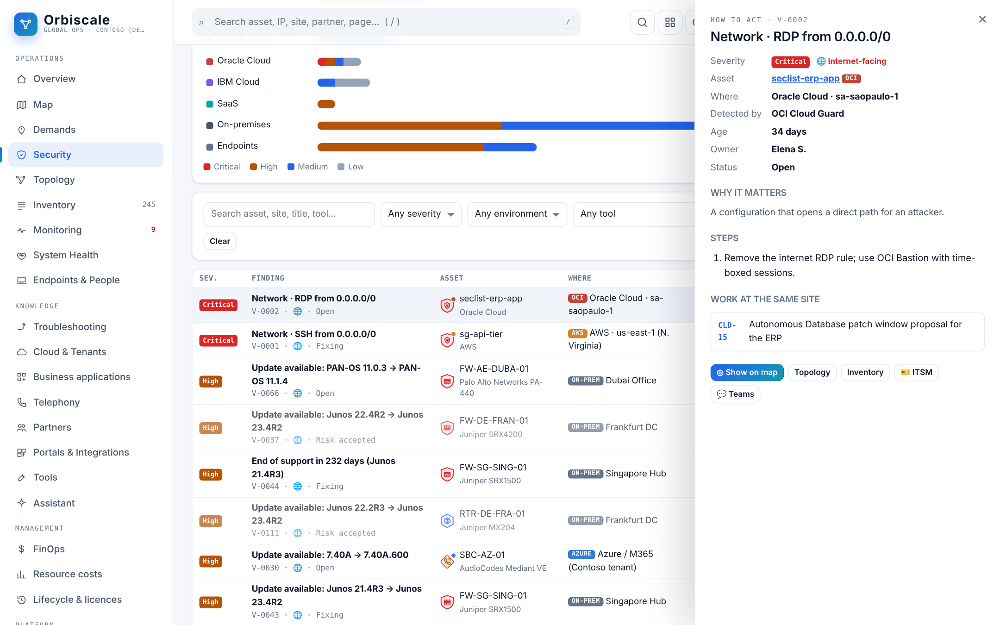 |
| **Lifecycle & licences** | **Business applications** |
| 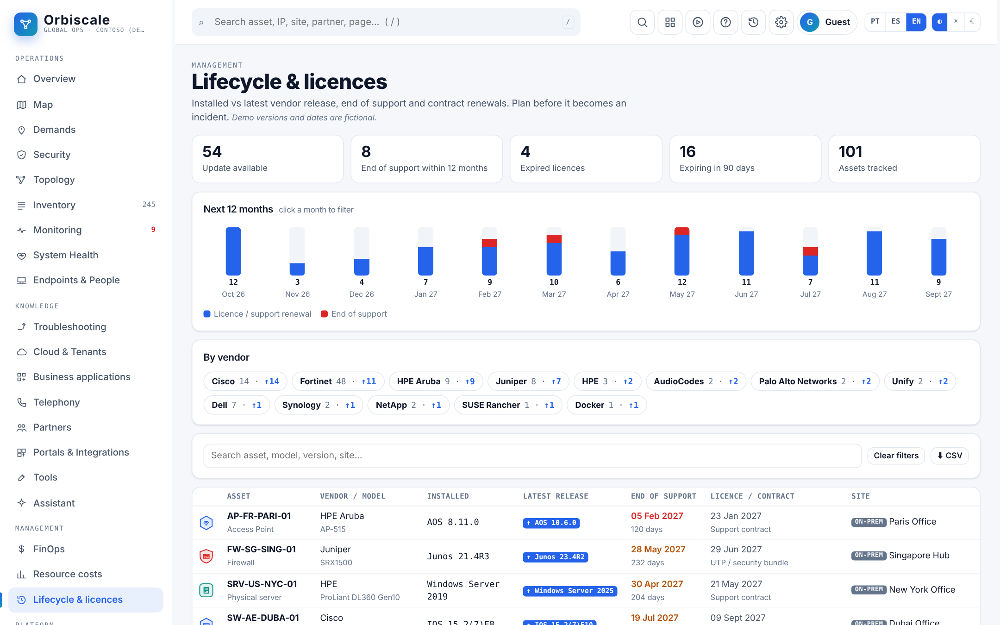 | 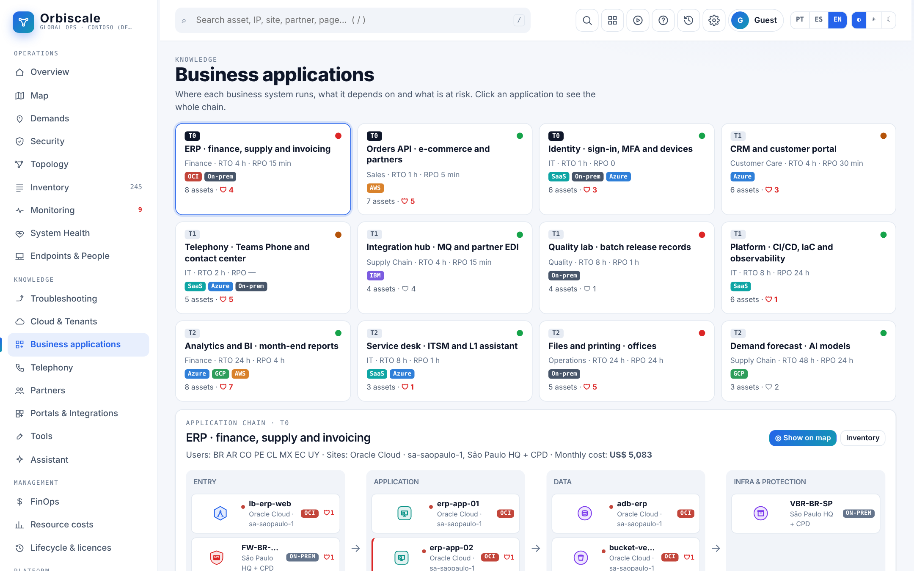 |
| **Endpoints from several tools** | **Voice intake** |
| 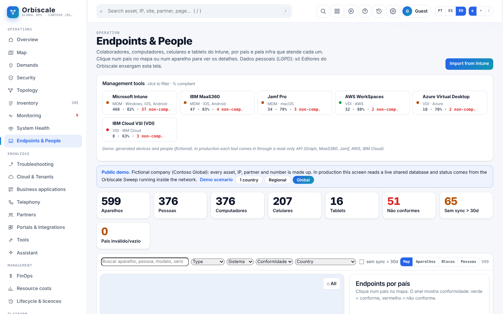 | 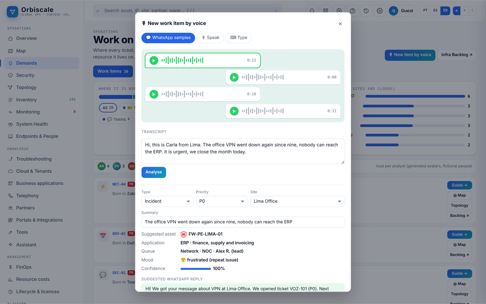 |

## ✨ v5.1 · Smooth, readable, actionable

- **Smooth:** zoom and pan move the map as one GPU layer and redraw once when you stop — up to 6× fewer janky frames in our benchmark.
- **Readable:** one icon and one frame shape per asset family, an origin badge for cloud resources and a provider ring on cloud markers.
- **Actionable:** work pins on the map open a guide with next steps and the exact inventory affected; *Management › Resource costs* lists every resource's monthly cost with CSV export.
- **Yours:** view preferences for map and topology (pins, WAN lines, labels, focus, animations, map style).

## ✨ v5 · Multicloud, work on the map and FinOps

| | |
|---|---|
| **Origin on every screen** | Every site and resource carries a badge: on-prem, Azure, AWS, Google Cloud, Oracle Cloud, IBM Cloud or SaaS. Map cards, tables and FinOps use the same colours. |
| **Multicloud, for real** | Cloud & Tenants lists what discovery found per provider (VMs, Kubernetes, databases, Blob/S3/COS, Key Vault/Secrets Manager/Key Protect, Fabric, load balancers), the **network design** (how each cloud reaches the company: VPN gateways, Transit Gateway, FastConnect, Direct Link) and every **NSG / security group / security list rule**. Topology has a view per cloud. |
| **Work on the map** | *Demands* shows where every ticket, project, e-mail, meeting, Teams thread, change and alert is **born** and which site or resource it **lives on**, with the analyst, age and status. Map cards show what lives at each site. Links go both ways with Infra Backlog. |
| **Findings become action** | Read-only discovery flags risks (SSH/RDP open to the internet, public storage, vault logs, Kubernetes control plane, firmware). One click drafts the ITSM ticket or the Teams post — the demo never sends anything. |
| **FinOps (Enterprise module)** | Cost by cloud, region, site and resource, 12-month trend, budget, untagged resources and savings recommendations (idle, orphan, schedule, commitments, rightsizing, tiering). **Role-based views**: Executive, Manager, Coordinator and Analyst — analysts get the tasks, not the prices. Prices only appear in FinOps. |
| **Executive palette** | New corporate default (trusted blue and teal, light and dark), splash screen while loading and lighter heavy views. |

| Work on the map | FinOps |
|---|---|
| 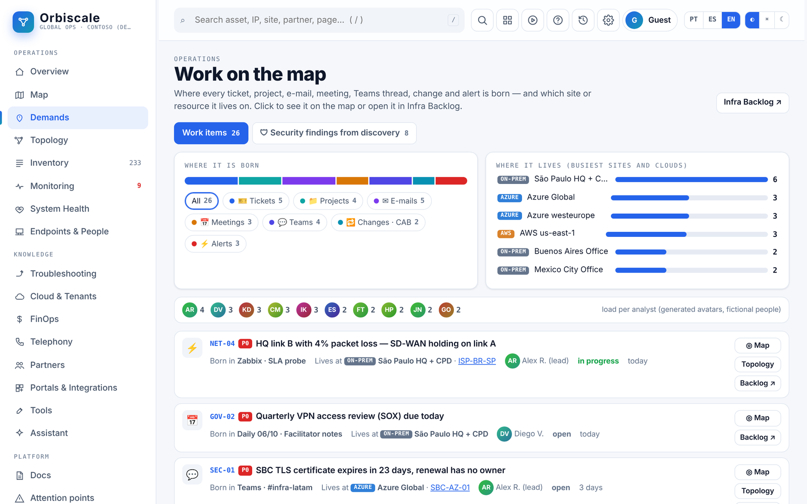 | 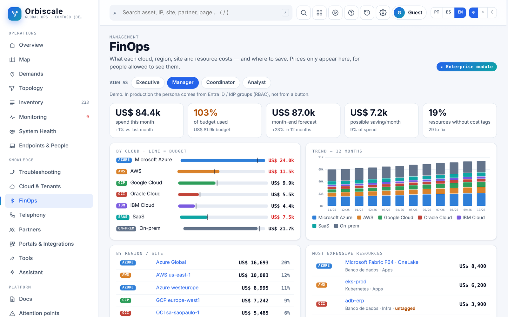 |
| **Multicloud** | **Network rules** |
| 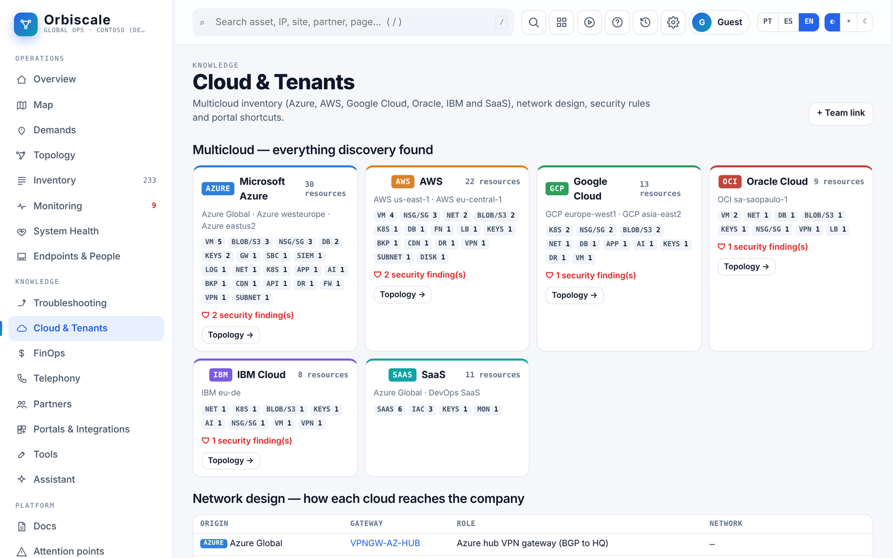 | 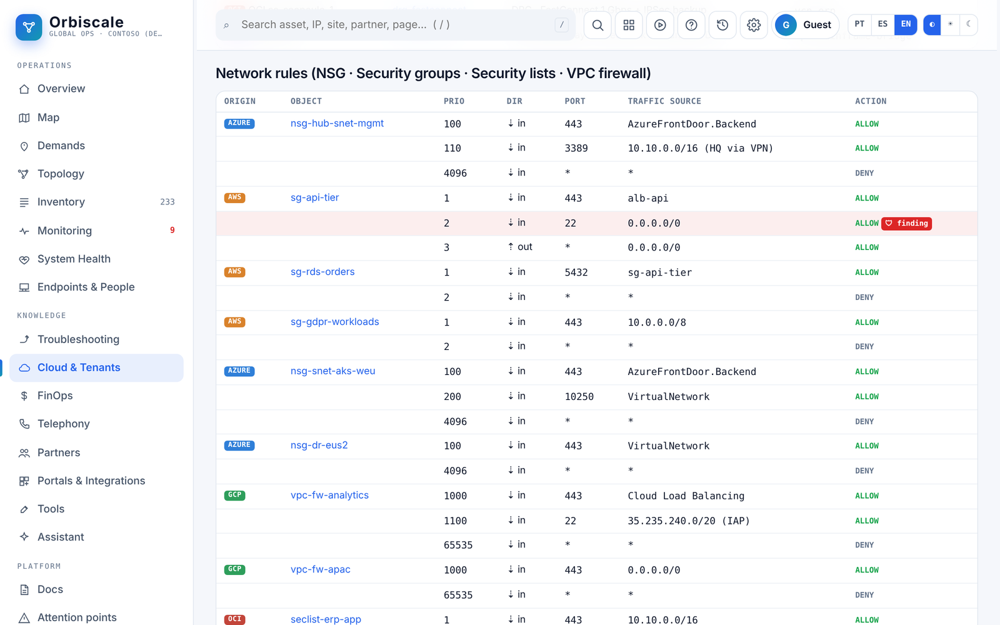 |
| **Security findings → ticket / Teams** | **Map with origin badges** |
| 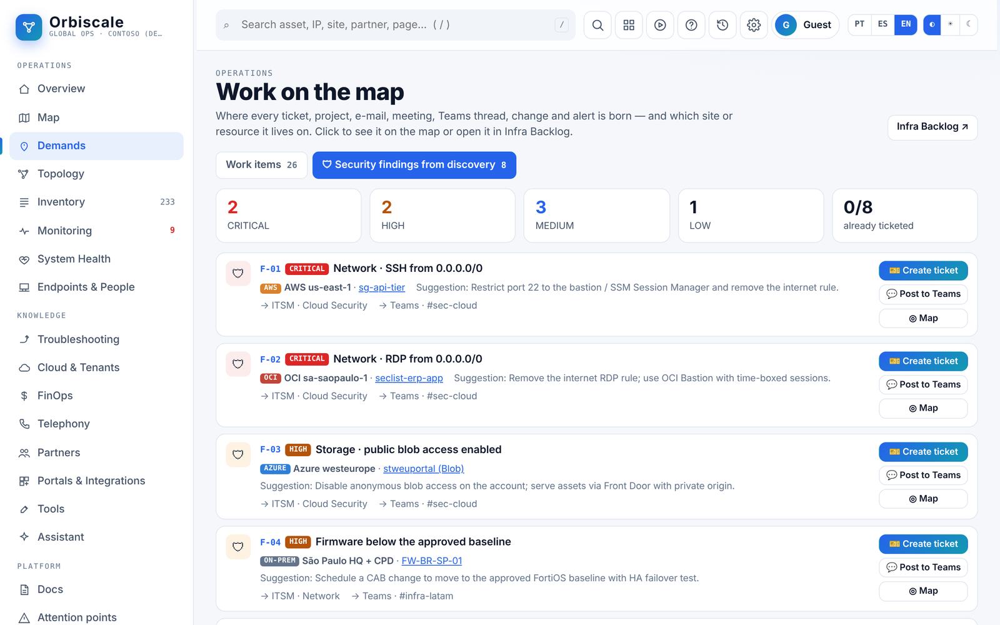 | 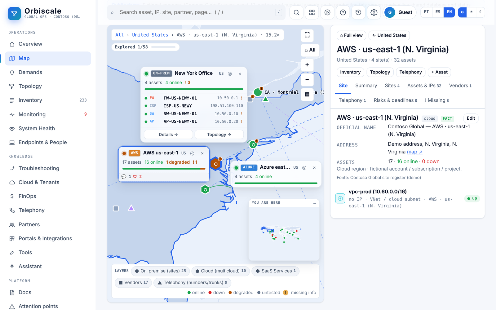 |

> FinOps role switching in the demo is a button; in production the role comes from Entra ID / IdP groups (RBAC). All prices, people and tickets are fictional.

## ✨ v4 · A live map

| | |
|---|---|
| **Cards that float, never collide** | Every site opens a card next to its dot. Cards avoid each other, the markers and the controls, glide into place and can be dragged anywhere, pinned or closed. |
| **Detail follows your zoom** | Far away a site is a blurred chip, closer it shows a summary, up close the full asset list with IPs. Labels that would overlap blur until you hover them. |
| **You are here** | A minimap on the map and on the topology; click or drag it to travel. An exploration chip counts the sites and countries you have opened. |
| **Tidy topology** | Drag assets to make room (nothing is saved, *Re-arrange* undoes it). Titles shorten with an ellipsis instead of running into the next zone. |
| **Your colours** | Settings › Look and colours: 7 palettes or your own brand colours, with a contrast check. |
| **Contact and support** | Report a problem from inside the app (pre-filled GitHub draft that refuses passwords and tokens), private security reports, commercial licence. |

| Live cards (light) | Live cards (dark) |
|---|---|
| 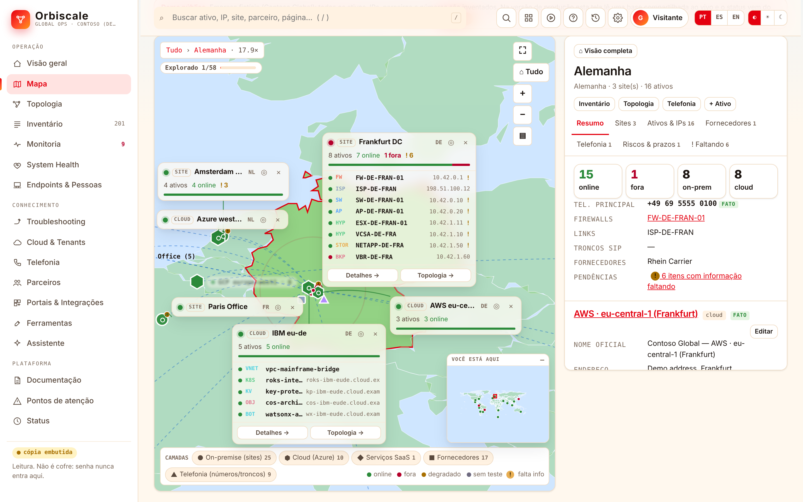 | 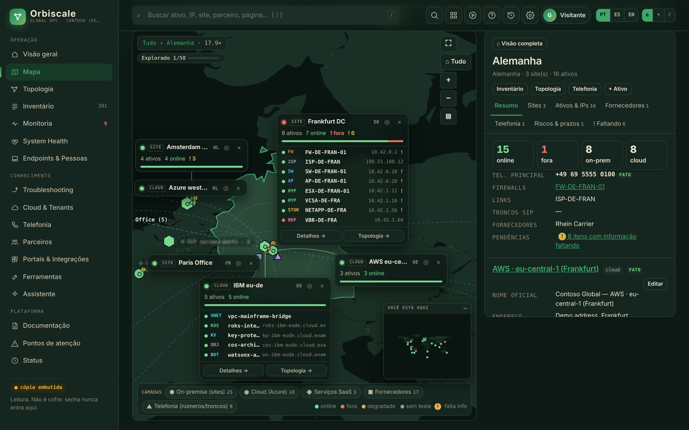 |
| **Topology** | **Look and colours** |
| 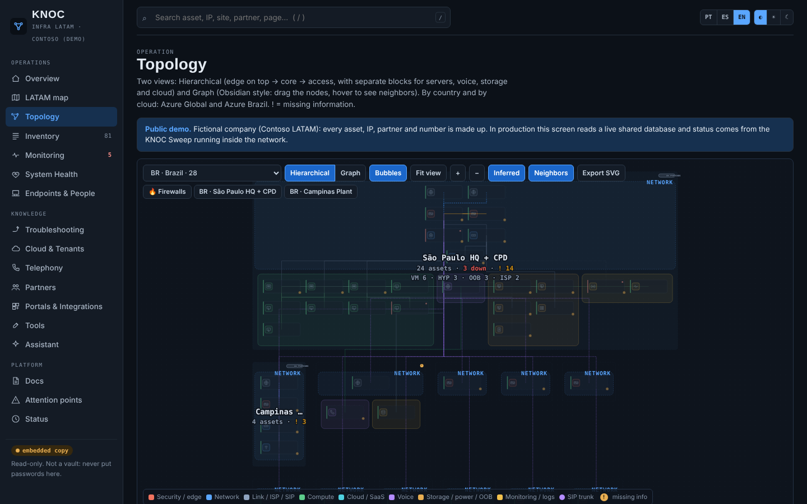 | 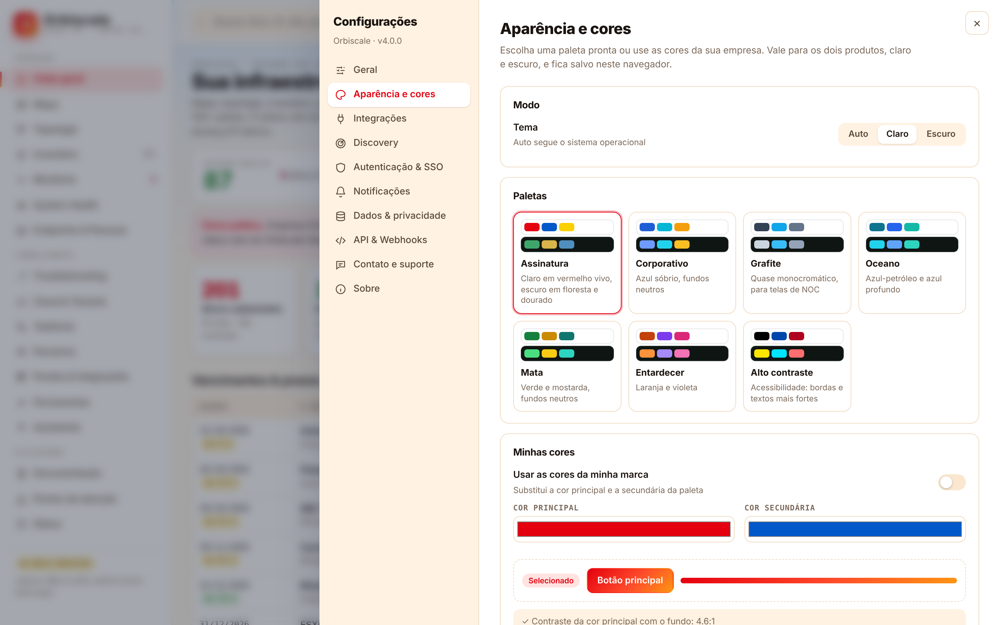 |

## ✨ v3 — Global & multicloud

| | |
|---|---|
| **Fits any footprint** | Countries come from *your* data. Register a site anywhere and the world map frames itself around it: 1 country, a region or 25 countries. |
| **Demo scenarios** | Switch the demo between **1 country · Regional · Global** in the blue notice at the top. |
| **Multicloud on the map** | AWS, Azure, Google Cloud, Oracle Cloud and IBM Cloud regions sit on their real location, wired to your sites (VPN, Direct Connect, ExpressRoute, Interconnect, FastConnect, Direct Link). |
| **Every layer** | IaaS, PaaS and SaaS: VPCs/VNets, VMs, Kubernetes, containers, functions, apps, bots/AI, databases, object storage, key vaults (names only), backup and DR replicas. |
| **On-prem too** | VMware vSphere, Proxmox VE, Hyper-V, Nutanix, Docker, Kubernetes (RKE2, OpenShift), Veeam, Commvault, NetApp. |
| **Discovery** | Settings › Discovery: read-only collectors for 13 platforms + Terraform state and Ansible inventory. Script → JSON → import. See [`discovery/`](discovery/README.md). |
| **Full-screen work area** | Map and topology take the whole viewport; ⛶ for true full screen. |
| **36 integrations** | ServiceNow, Jira SM, ServiceDesk Plus, Zabbix, Datadog, Prometheus, Splunk, Sentinel, Teams, Slack, PagerDuty, NetBox, Veeam, Terraform Cloud, AWX, Vault, Okta, FortiGate API… |
| **Secure by default** | Demo sign-in (Entra ID, Google, GitHub, enterprise SSO) with **no password field**; connectors read-only; secrets only as a vault *reference*. |

| Map (global) | Topology |
|---|---|
| 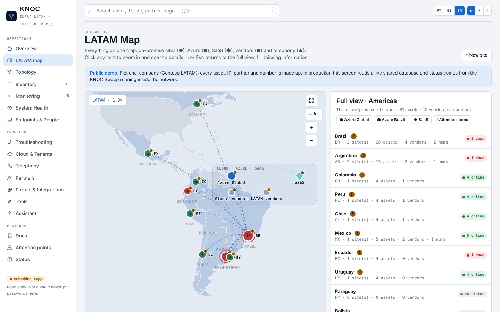 |  |
| **Discovery** | **Mobile** |
| 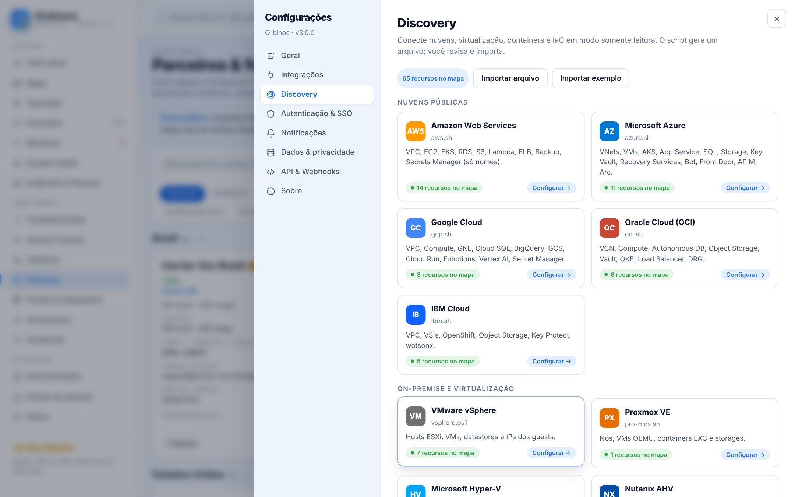 | 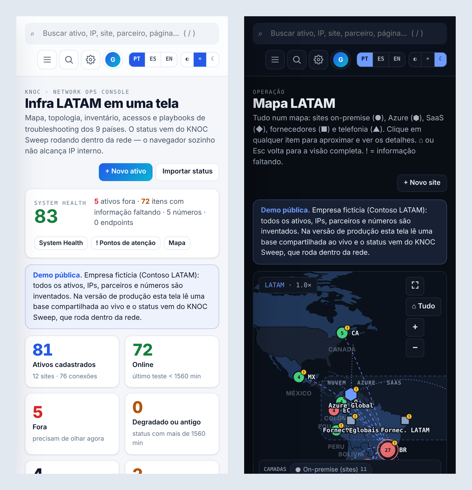 |

---

## Run it on your machine (localhost)

Pick one. All of them serve static files on `127.0.0.1` only.

**macOS / Linux**
```bash
git clone https://github.com/netorojas/knoc-network-ops-console.git
cd knoc-network-ops-console
./serve.sh                 # opens http://localhost:8080/?nologin
```

**Windows (PowerShell)**
```powershell
git clone https://github.com/netorojas/knoc-network-ops-console.git
cd knoc-network-ops-console
.\serve.ps1
```

**Docker**
```bash
docker compose up -d       # http://localhost:8080/?nologin
```

**Whole suite side by side** (Orbiscale + Infra Backlog, with the suite switcher working):
```bash
mkdir contoso-ops && cd contoso-ops
git clone https://github.com/netorojas/knoc-network-ops-console.git
git clone https://github.com/netorojas/infra-backlog-dashboard.git
python3 -m http.server 8080 --bind 127.0.0.1
# http://localhost:8080/knoc-network-ops-console/   ·   http://localhost:8080/infra-backlog-dashboard/
```

Useful URL flags: `?nologin` skips the demo sign-in · `?scenario=single|regional|global` picks the demo footprint.

> A hosted multi-tenant version (sign-in, shared database, scheduled discovery) is on the roadmap. The localhost mode will stay.

---

## The problem

It started with a 9-country operation. Each country had its own firewalls, ISPs, SIP carriers and vendors, plus servers and cloud workloads, and the information was spread across spreadsheets, password-manager titles, e-mails and people's heads. When something broke, the first 20 minutes went to *"what is this host, who is the carrier, where is the console?"*. Orbiscale answers that in one click, at any scale.

## What it does

| Area | What you get |
|---|---|
| **Overview / System Health** | Assets down, stale status, missing data, open risks, deadlines (contracts, certificates, EOS) |
| **Map** | Sites, cloud regions, SaaS, partners and phone numbers on a world map that frames itself around your footprint |
| **Topology** | Hierarchical (edge → core → access + compute, data/backup/DR, voice and cloud blocks) and a force-directed graph. SVG export |
| **Inventory** | Every asset with vendor, model, version, IP/FQDN and a confidence label (FACT / PROBABLE / HYPOTHESIS) |
| **Troubleshooting** | Fixed layer order (Network → Firewall → DNS → DHCP → VPN → Cloud → M365 → Windows Server → App → Endpoint) with copy-ready read-only commands |
| **Telephony** | Teams Direct Routing → SBC → carrier → country, with numbers, IVRs and trunks |
| **Partners & portals** | Who serves each country, the official support channel and what to monitor |
| **Assistant** | A chat that reads only this portal's data and never runs anything on the network |
| **i18n + themes** | PT · ES · EN, light and dark |

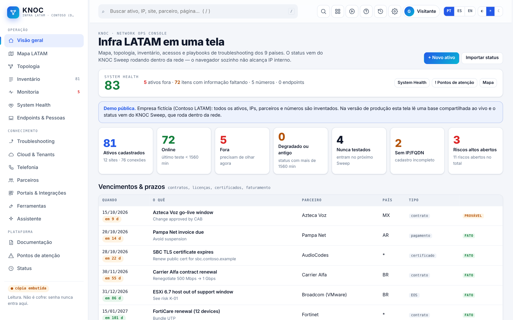

## Architecture

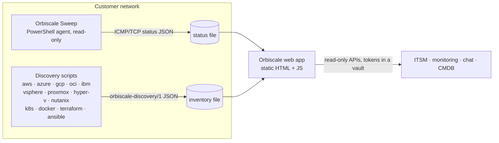
```mermaid
flowchart LR
  subgraph Customer network
    SW[Orbiscale Sweep<br/>PowerShell agent, read-only] -->|ICMP/TCP status JSON| F[(status file)]
    D[Discovery scripts<br/>aws · azure · gcp · oci · ibm<br/>vsphere · proxmox · hyper-v · nutanix<br/>k8s · docker · terraform · ansible] -->|orbiscale-discovery/1 JSON| F2[(inventory file)]
  end
  F --> UI[Orbiscale web app<br/>static HTML + JS]
  F2 --> UI
  UI -->|read-only APIs, tokens in a vault| I[ITSM · monitoring · chat · CMDB]
```

## Support and security

- Questions and bugs: [GitHub Issues](../../issues) (or *Help › Report a problem* inside the app).
- Vulnerabilities: private report, see [SECURITY.md](SECURITY.md).
- Commercial licence and support: [COMMERCIAL.md](COMMERCIAL.md).

## Licence

Orbiscale is **open-core**:

- **Community edition (this repo): [AGPL-3.0-or-later](LICENSE).** Use it, study it, change it. If you offer it to others as a hosted service, publish your changes.
- **Commercial licence:** use without the AGPL obligations, enterprise modules and support — see [COMMERCIAL.md](COMMERCIAL.md).
- Releases up to v2.x were published under MIT and stay MIT. Names and logos are not covered by the AGPL ([NOTICE](NOTICE)).
- Contributions: [CONTRIBUTING.md](CONTRIBUTING.md) (short CLA).

## Tech

Vanilla JavaScript, inline SVG for the map, topology and charts, CSS custom properties for theming. World outlines from Natural Earth ([third-party notices](THIRD_PARTY_NOTICES.md)). No frameworks, no runtime dependencies.

---

**Author:** Ernesto Rojas (Neto) · Infrastructure, Cloud & Security · [LinkedIn](https://www.linkedin.com/in/netorojas/)
🇧🇷 *Console de operação de rede que se adapta ao seu ambiente: de 1 país ao mundo, multicloud.* · 🇪🇸 *Consola de operación de red que se adapta a tu entorno: de 1 país al mundo, multinube.*
