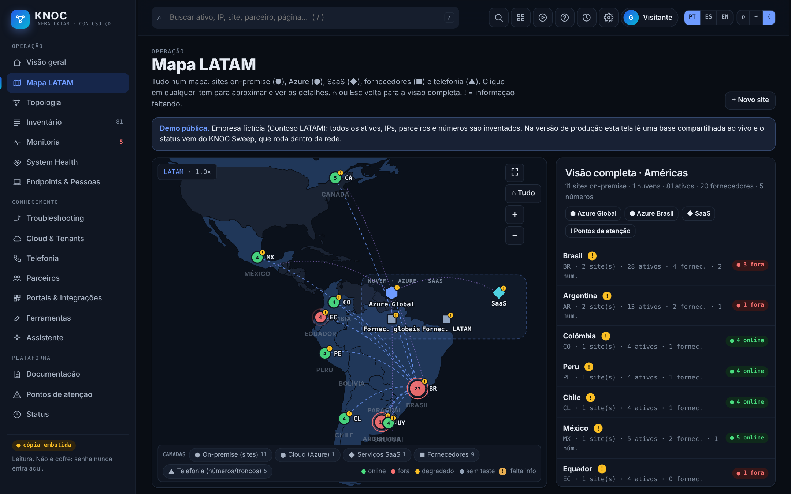
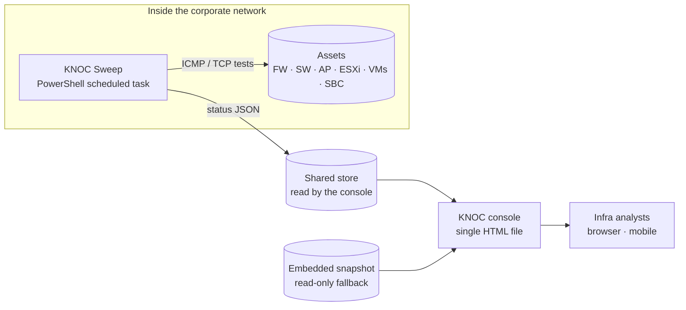
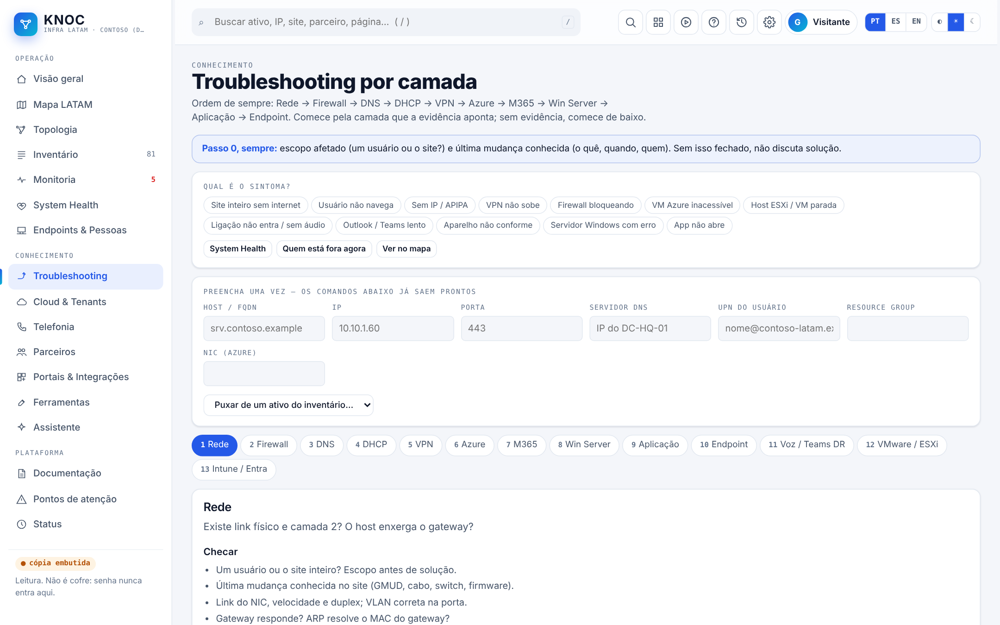
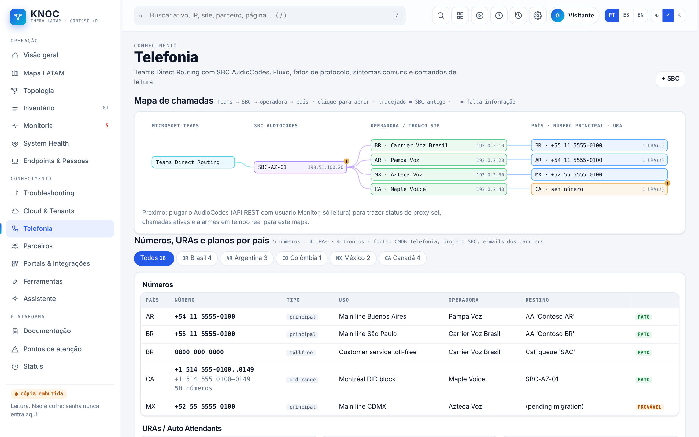
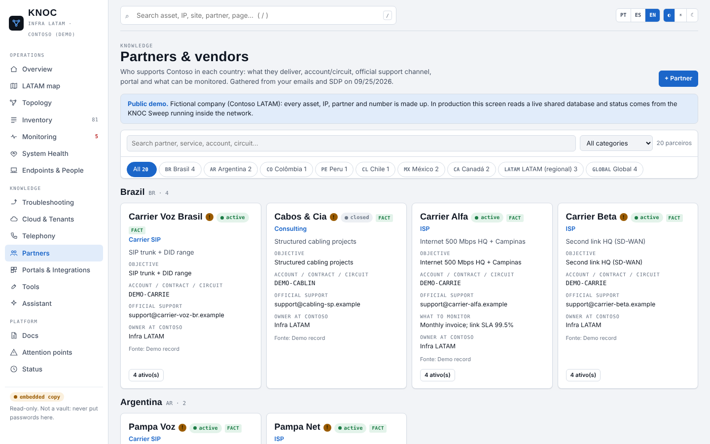

# KNOC · Network Ops Console

**A single-screen operations console for a 9-country LATAM infrastructure:** map, topology, inventory, health, telephony, partners and layer-by-layer troubleshooting playbooks. Everything is in one HTML file, with no backend and no build step.

> 🔗 **Live demo:** https://netorojas.github.io/knoc-network-ops-console/
> 🧪 All data is **fictional** (company "Contoso LATAM"). IPs come from the RFC 1918 and RFC 5737 documentation ranges.


▶️ [Full 40-second walkthrough (MP4)](docs/media/knoc-demo.mp4)

---


## The problem

The infra team supported 9 countries. Each country had its own firewalls, ISPs, SIP carriers and vendors, plus servers and cloud workloads, and the information was spread across spreadsheets, KeePass titles, e-mails and people's heads. When something broke, the first 20 minutes went to answering *"what is this host, who is the carrier, where is the console?"*

## What KNOC does

| Area | What you get |
|---|---|
| **Overview / System Health** | Assets down, stale status, missing data, open risks, upcoming deadlines (contracts, certificates, EOS) |
| **LATAM map** | Sites, cloud, SaaS, partners and phone numbers on one map, with drill-down by country |
| **Topology** | A hierarchical view (edge → core → access, plus compute, voice and cloud blocks) and a force-directed graph. Exports to SVG |
| **Inventory** | 80+ assets with vendor, model, version, IP, FQDN and a confidence label (FACT / LIKELY / HYPOTHESIS) |
| **Troubleshooting** | A fixed layer order (Network → Firewall → DNS → DHCP → VPN → Azure → M365 → Windows Server → App → Endpoint). Fill in host and IP once, and every command comes out ready to copy (PowerShell, FortiOS CLI, AudioCodes, Graph) |
| **Telephony** | Teams Direct Routing → SBC → carrier → country call map, with numbers, IVRs and trunks |
| **Partners & portals** | Who serves each country, what they deliver, the official support channel and what to monitor |
| **Assistant** | A chat that reads only this portal's data and never runs anything on the network |
| **i18n + themes** | PT · ES · EN, light and dark |



## Architecture



- **Why a Sweep agent?** A browser cannot reach private IPs. The Sweep runs inside the network and publishes only up/down/latency, never credentials.
- **Graceful degradation:** if the live store is unavailable, the console falls back to an embedded read-only snapshot. This public demo runs in that mode.
- **Security by design:** the edit form rejects anything that looks like a password, token or private key. Credentials stay in a vault (Key Vault, KeePass or RDM). Personal data such as endpoints and people is never included in the snapshot.

## Screenshots

| Topology | Troubleshooting |
|---|---|
|  |  |
| **Telephony** | **Partners** |
|  |  |

## Run it locally

```bash
git clone https://github.com/netorojas/knoc-network-ops-console.git
cd knoc-network-ops-console
python3 -m http.server 8080   # then open http://localhost:8080
```

To regenerate the demo data, run `python3 tools/gen_knoc_snapshot.py > snapshot.json`. The generator is deterministic (fixed seed) and 100% synthetic.

## Tech

Vanilla JavaScript, inline SVG for the map, topology and charts, and CSS custom properties for theming. There are no frameworks and no dependencies, so it opens on any laptop or phone.

## What I would do next

- Pull live data from read-only APIs: the FortiGate REST API, AudioCodes (Monitor user), Azure Resource Graph and the Zabbix API, with tokens kept in Key Vault.
- Add alert routing to Teams with deduplication.
- Generate a CMDB export for ITSM (ServiceDesk Plus).

---

**Author:** Ernesto Rojas (Neto), Senior Infrastructure Engineer · Fortinet · Azure · LATAM operations
🇧🇷 *Console de operação de rede para 9 países, com dados fictícios.* · 🇪🇸 *Consola de operación de red para 9 países, con datos ficticios.*
