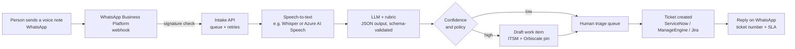

# Voice intake · from a WhatsApp voice note to a work item on the map

> Status: **demo in the browser** (Orbiscale 5.2). This page describes how the production version would work.
> Nothing here is a commitment to a specific vendor; product names are examples.

## What the demo does

1. You pick a WhatsApp-style voice note (samples), speak (browser speech recognition, where available) or type.
2. Simple rules stand in for the model: they find the **site** (city names), the **asset** (VPN, Wi-Fi, printer, link, phone…), the **application** (ERP, BI, CRM…), the **type** (incident, request, question), the **priority** and the **mood** (repeat issue).
3. You review and edit everything, then create a **draft** work item. It shows up in *Demands* and as a pin on the map, with a suggested WhatsApp reply.

Everything runs in your browser. The demo stores the items you create in `localStorage` (`osc.voice7`) and a button clears them.

> Browser speech recognition (Chrome/Edge) may send audio to the browser vendor's speech service. The demo says so before you speak.

## Production architecture



### Output contract (what the model must return)

```json
{
  "channel": "whatsapp",
  "type": "incident | request | question",
  "priority": "P0 | P1 | P2",
  "site": "pe-lima",
  "asset": "fw-pe-lima-01",
  "app": "erp",
  "queue": "Network · NOC",
  "sentiment": "neutral | frustrated",
  "summary": "Office VPN down since 09:00, nobody can reach the ERP",
  "confidence": 0.86,
  "needs_human_review": true
}
```

The API rejects anything that does not match the schema. Site and asset must exist in the Orbiscale inventory; otherwise they stay empty for a human to fill in.

## Guardrails

| Area | Rule |
|---|---|
| Consent (LGPD / GDPR) | First message explains what is recorded, why and for how long; the person opts in before the first audio is processed. |
| Retention | Audio deleted after transcription (default 24 h); the transcript lives with the ticket under the ticket's retention policy. |
| Data location | Speech and model endpoints in the same region as the ITSM data; DPA with each processor. |
| Human in the loop | The model creates **drafts**. A person confirms priority P0/P1 and anything below the confidence threshold. |
| Bias | Accent, stutter and background noise must not lower priority; the rubric scores content, not delivery. Monthly sample review. |
| Security | Webhook signature validated before parsing; secrets in a vault (never in code); least-privilege service account for the ITSM connector. |
| Abuse | Rate limits per number; prompt-injection text in a transcript is treated as data, never as instructions. |

## Other uses of the same pipeline

- **Support / FAQ**: answer from the knowledge base first, open a ticket only when needed.
- **Sales coaching**: score a call recording against a rubric (objection handling, next step).
- **Recruitment screening**: the pattern used by audio screening tools. Highest legal and fairness risk; always a human decision.

## Rollout in three waves

1. **Pilot**: one internal team, one WhatsApp number, drafts only, weekly review of 100% of items.
2. **Scale**: more countries/languages, confidence threshold tuned with real data, ITSM connector live.
3. **Product**: multi-tenant, per-customer rubric, usage-based pricing.
